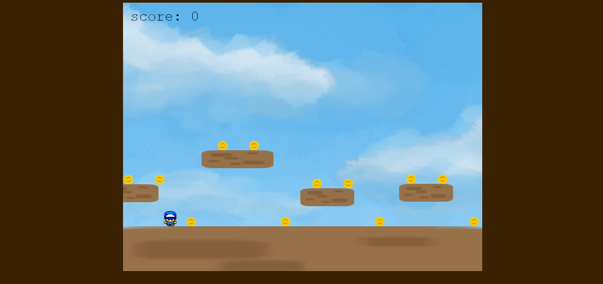

# Projet Mini Jeu Web en JS avec Phaser3

## Instruction à suivre pour l'exécution

-   Téléchager les fichiers
-   Mettre les fichiers dans le repertoire de votre serveur (C:\xampp\htdocs\phaser-game-js si vous êtes sur XAMPP)
-   Ensuite exécutez le projet avec votre navigateur web http://localhost/phaser-game-js/ pour voir le jeu

### Auteur
-   Jean-Luc DOH